# Exemples de diagrammes

## 1. Diagramme de Cas d'Utilisation (Use Case Diagram)

**Projet type :** Application de gestion de tâches (To-Do List)

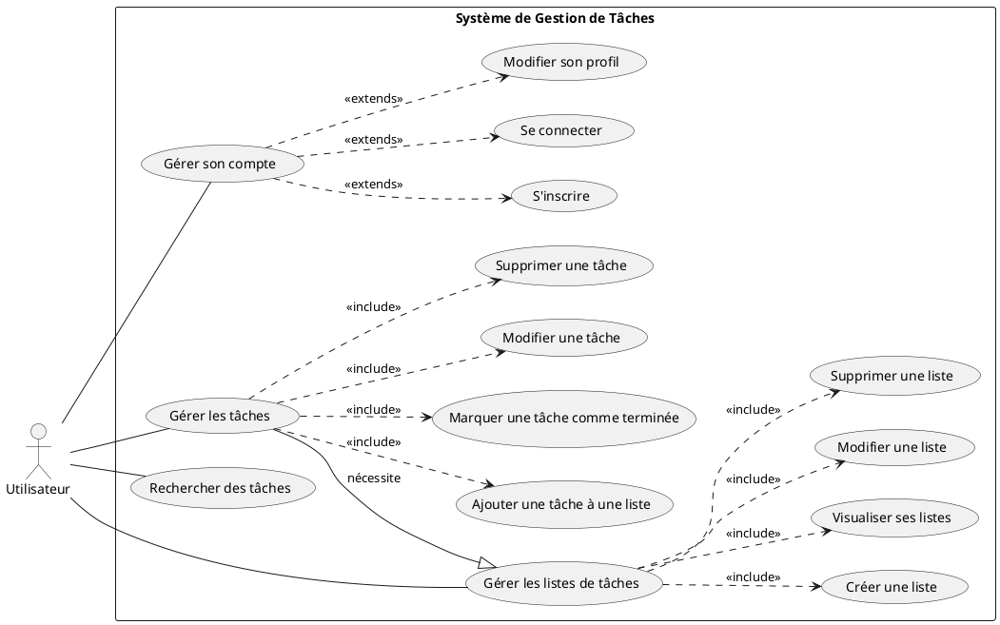

---

## 2. Wireframes (Représentation Conceptuelle de la Navigation)

**Projet type :** Application de gestion de tâches - Flux d'ajout de tâche

### Connexion


### Inscription


### Liste des tâches


### Tableau de bord


### Ajout de liste


### Ajout de tâche


### Confirmation de suppression


---

## 3. Diagramme de Navigation (Plus formel)

Représente les transitions possibles entre les principaux états/écrans de l'application.

**Projet type :** Application de gestion de tâches

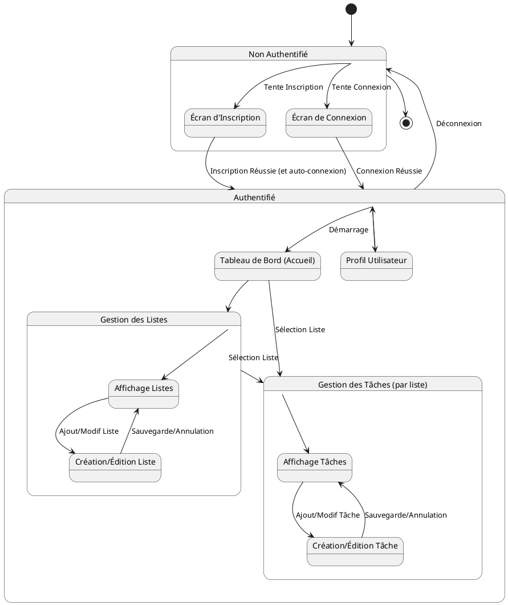

---

## 4. Modèle Conceptuel de Données (MCD) - Style Entité-Association

**Projet type :** Application de gestion de tâches

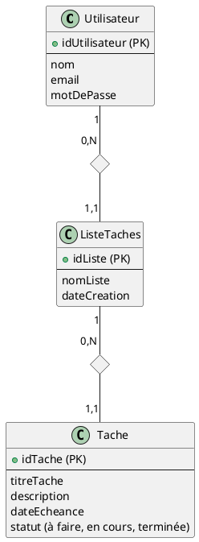

*Note: PlantUML n'a pas de support natif parfait pour la notation MCD Merise. Ceci est une adaptation.*

---

## 5. Modèle Logique de Données (MLD) - Proche Schéma Relationnel

**Projet type :** Application de gestion de tâches

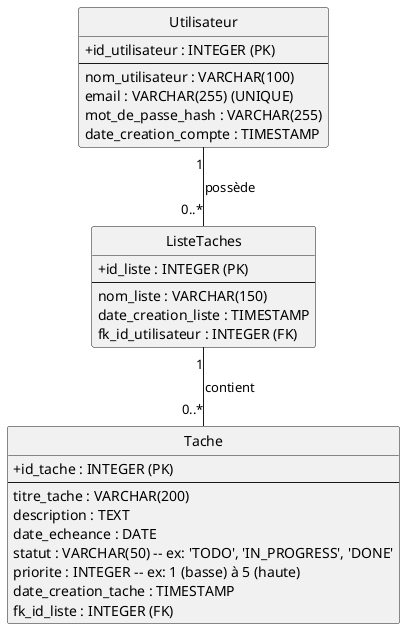

---

## 6. Diagramme de Classes (Vue Conception)

**Projet type :** Application de gestion de tâches (simplifié, focus sur le domaine)

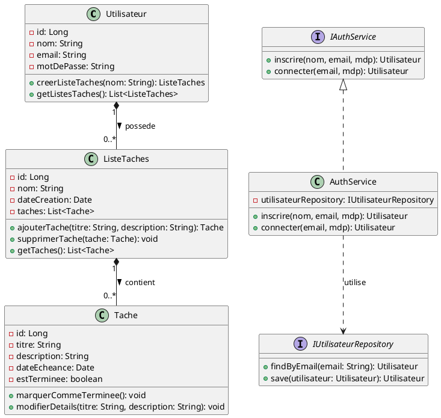

---

## 7. Diagramme de Classes Participantes (Pour un Cas d'Utilisation Spécifique)

**Cas d'Utilisation :** Ajouter une tâche à une liste

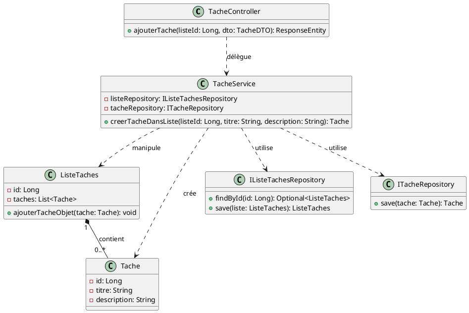

---

## 8. Diagramme de Séquence Système

**Cas d'Utilisation :** L'utilisateur ajoute une tâche.

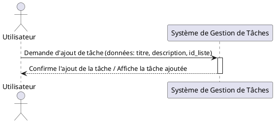

---

## 9. Diagramme de Séquence Détaillé

**Cas d'Utilisation :** Ajouter une nouvelle tâche (avec architecture MVC/Service)

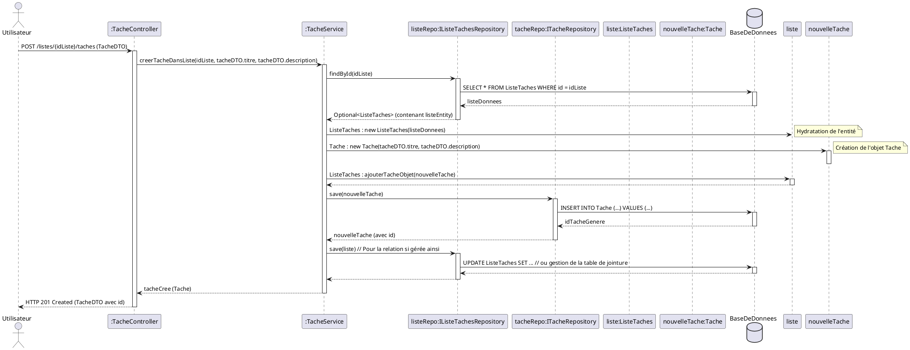

---

## 10. Diagramme d'Architecture (Vue Logique N-Tiers)

**Projet type :** Application Web avec API REST

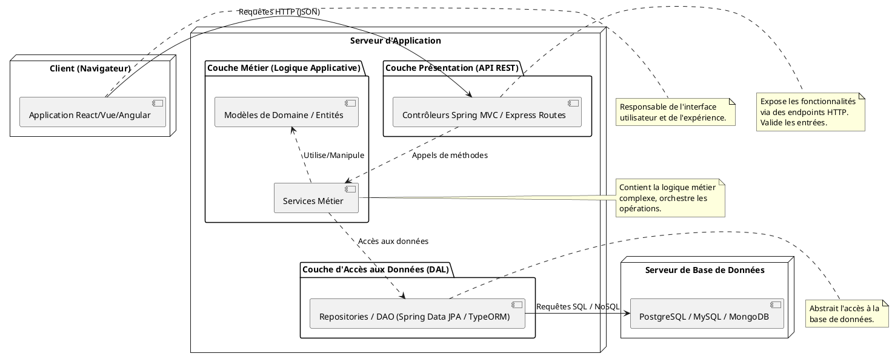

---

## 11. Diagramme d'Activité

**Activité :** Processus d'inscription d'un nouvel utilisateur

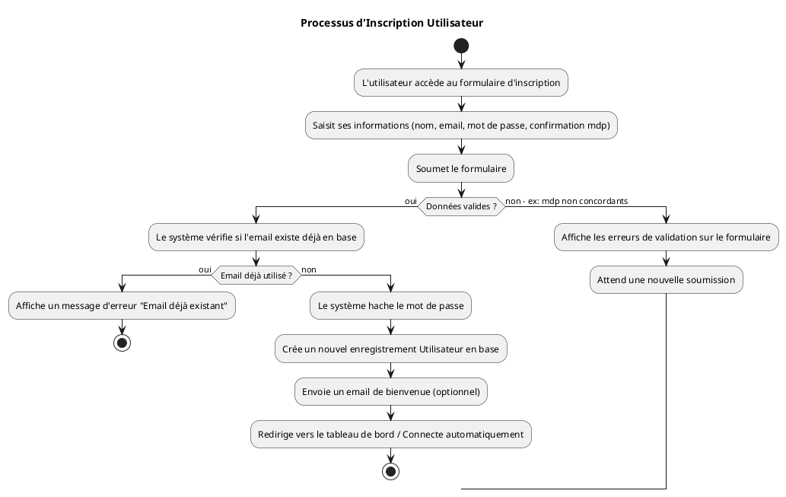

---

## 12. Diagramme d'État-Transition

**Objet :** État d'une `Tache`

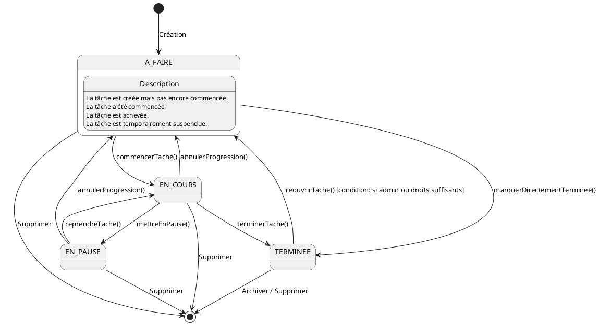

---

## Diagrammes Explicatifs Additionnels

### A. Pattern MVC (Modèle-Vue-Contrôleur)

```plantuml
@startuml
!define MODEL class
!define VIEW component
!define CONTROLLER class

package "Modèle (Model)" {
  MODEL DonneesApplicatives {
    + getData()
    + setData()
  }
  MODEL LogiqueMetier {
    + processData()
  }
  DonneesApplicatives -- LogiqueMetier
}

package "Vue (View)" {
  VIEW InterfaceUtilisateur {
    + displayData(data)
    + getUserInput()
  }
}

package "Contrôleur (Controller)" {
  CONTROLLER ControleurPrincipal {
    - model: LogiqueMetier
    - view: InterfaceUtilisateur
    + handleUserInput()
    + updateView()
  }
}

ControleurPrincipal ..> InterfaceUtilisateur : "Met à jour"
InterfaceUtilisateur ..> ControleurPrincipal : "Notifie (Actions Utilisateur)"
ControleurPrincipal ..> LogiqueMetier : "Manipule"
LogiqueMetier ..> ControleurPrincipal : "Notifie (Changements d'état)" (via observateur par ex.)

note "1. L'utilisateur interagit avec la Vue" as N1
note "2. La Vue notifie le Contrôleur" as N2
note "3. Le Contrôleur manipule le Modèle (Logique Métier et Données)" as N3
note "4. Le Modèle (si son état change) peut notifier le Contrôleur (ou la Vue via observateur)" as N4
note "5. Le Contrôleur met à jour la Vue avec les nouvelles données du Modèle" as N5

N1 -[hidden]down-> N2
N2 -[hidden]down-> N3
N3 -[hidden]down-> N4
N4 -[hidden]down-> N5
@enduml
```

### B. Injection de Dépendances (Dependency Injection - DI)

**Exemple :** Un `OrderService` qui dépend d'un `IPaymentService` et d'un `IInventoryService`.

**Sans DI (Accouplement Fort) - à éviter :**

```plantuml
@startuml
class OrderService_Sans_DI {
  - paymentService: ConcretePaymentService
  - inventoryService: ConcreteInventoryService
  + OrderService_Sans_DI() {
    ' Couplage fort: instanciation directe
    ' des dépendances concrètes.
    ' Difficile à tester et à maintenir.
    paymentService = new ConcretePaymentService()
    inventoryService = new ConcreteInventoryService()
  }
  + placeOrder(orderData)
}
class ConcretePaymentService
class ConcreteInventoryService

OrderService_Sans_DI --o ConcretePaymentService
OrderService_Sans_DI --o ConcreteInventoryService
@enduml
```

**Avec DI (via Constructeur) - préférable :**

```plantuml
@startuml
interface IPaymentService {
  + processPayment(amount)
}
interface IInventoryService {
  + checkStock(productId)
}

class OrderService_Avec_DI {
  - paymentService: IPaymentService
  - inventoryService: IInventoryService
  + OrderService_Avec_DI(paySvc: IPaymentService, invSvc: IInventoryService) {
    ' Les dépendances (abstractions) sont
    ' "injectées" via le constructeur.
    ' Couplage faible, meilleure testabilité.
    this.paymentService = paySvc
    this.inventoryService = invSvc
  }
  + placeOrder(orderData)
}

class StripePaymentService implements IPaymentService
class PaypalPaymentService implements IPaymentService

class WarehouseInventoryService implements IInventoryService

OrderService_Avec_DI ..> IPaymentService : dépend de
OrderService_Avec_DI ..> IInventoryService : dépend de

package "Conteneur DI / Main Application" as DI_Container {
  DI_Container --> OrderService_Avec_DI : Crée et injecte
  DI_Container --> StripePaymentService : Crée
  DI_Container --> WarehouseInventoryService : Crée
  note "Le conteneur DI (ou le code d'initialisation)\nconstruit les dépendances concrètes\net les injecte dans OrderService."
}
@enduml
```

---

Le candidat doit se rappeler que ces diagrammes sont des outils pour communiquer la conception de son projet. Il doit
choisir ceux qui sont les plus pertinents pour expliquer les aspects clés de son travail et les adapter à son contexte
spécifique. La qualité et la clarté sont plus importantes que la quantité.